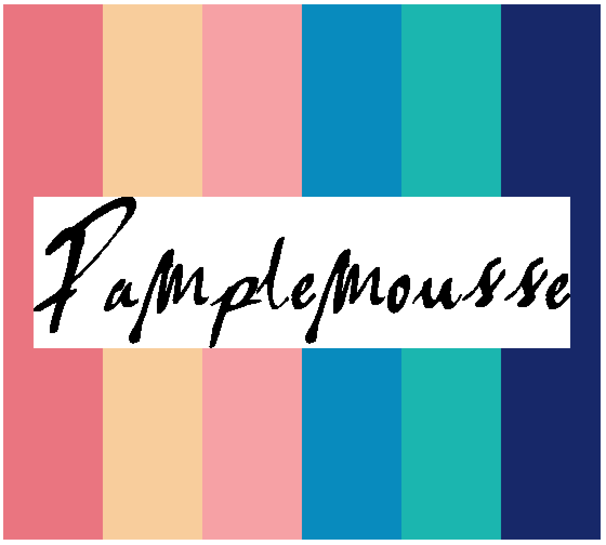
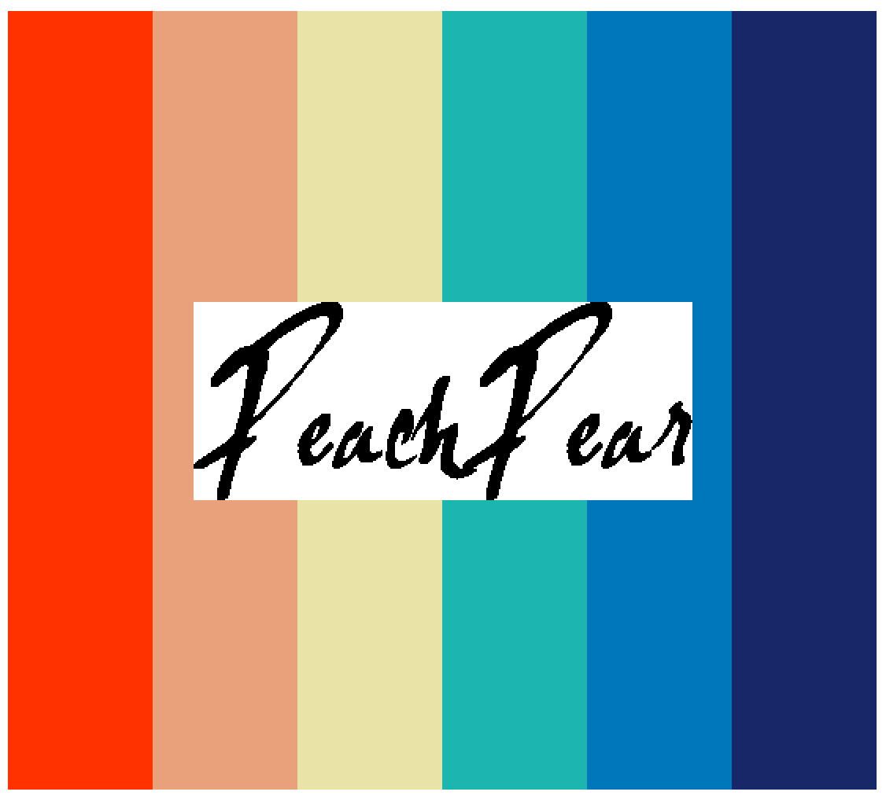
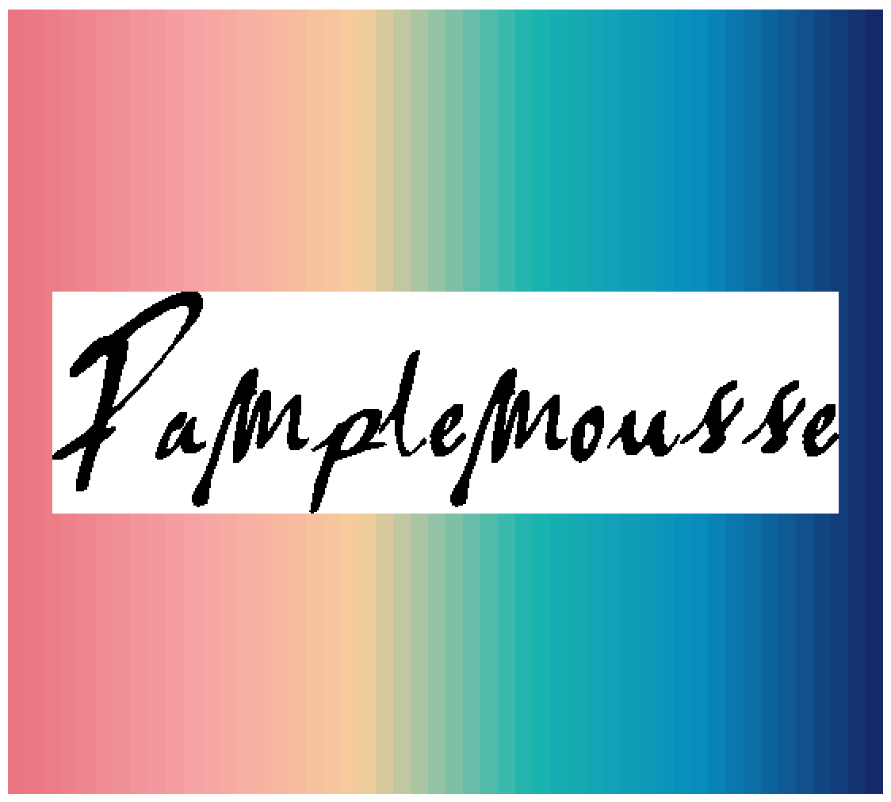
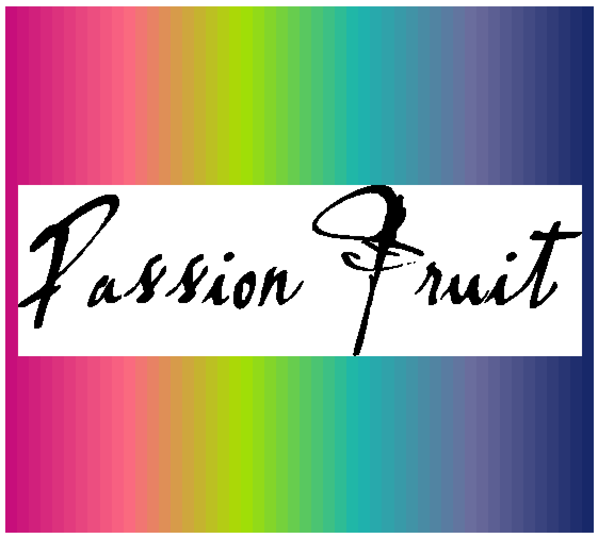
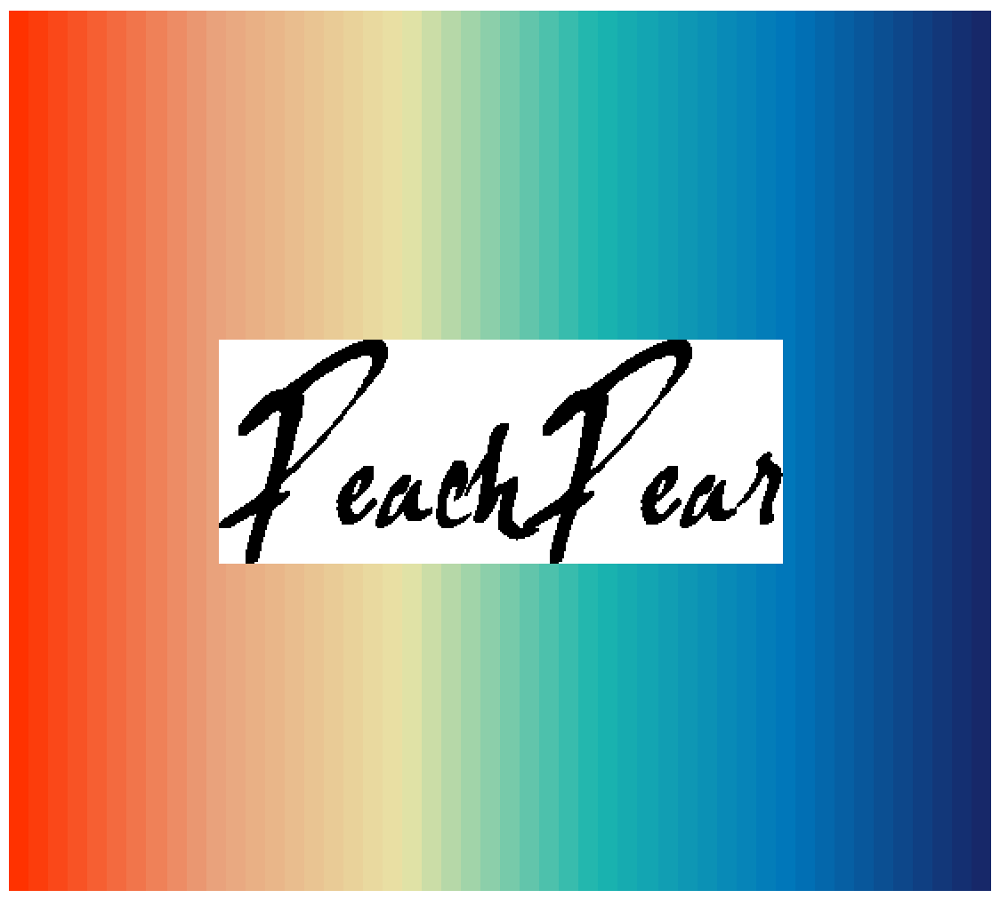
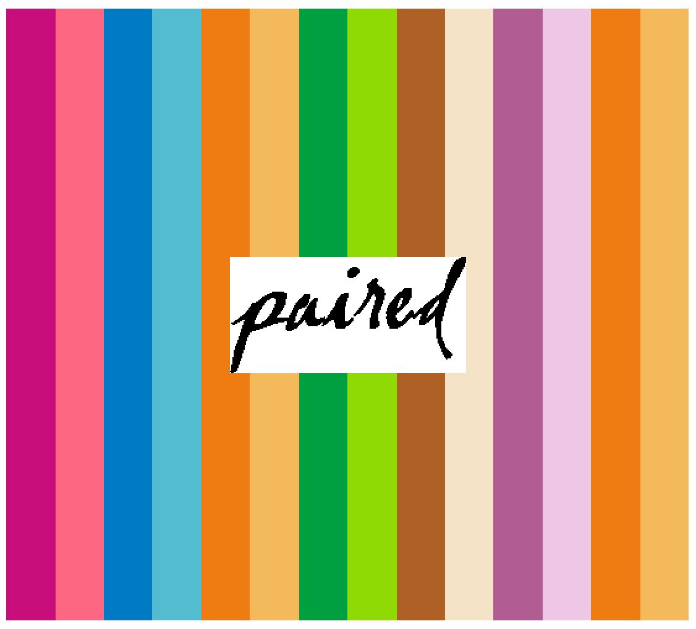

# LaCroixColoR (beta)
LaCroix Color Palettes for R. \
Choose from 20 different LaCroix falvors--quench your thirst!

## Install package

`install.packages("devtools")` \
`devtools::install_github('LaCroixColoR','johannesbjork')`

## For discrete palettes

`lacroix_palette("Pamplemousse", type = "discrete")`

`lacroix_palette("PassionFruit", type = "discrete")`

`lacroix_palette("PeachPear", type = "discrete")`

## For continuous palettes

`lacroix_palette("Pamplemousse", n = 25, type = "continuous")`

`lacroix_palette("Pamplemousse", n = 50, type = "continuous")`

`lacroix_palette("PassionFruit", n = 50, type = "continuous")`

`lacroix_palette("PeachPear", n = 50, type = "continuous")`

## For paired palette

`lacroix_palette(type = "paired")`

Contact: Dave Armitage (dave.armitage@gmail.com) & Johannes Bjork (bjork.johannes@gmail.com)
